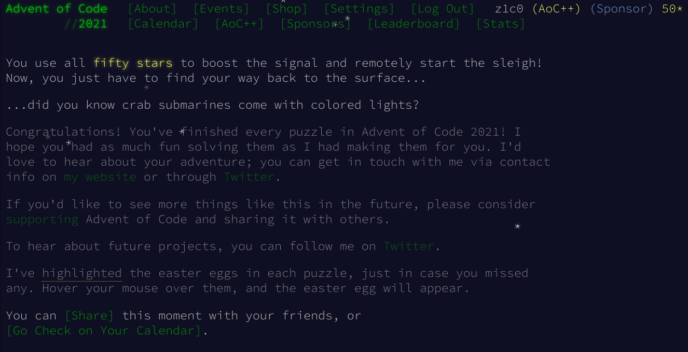
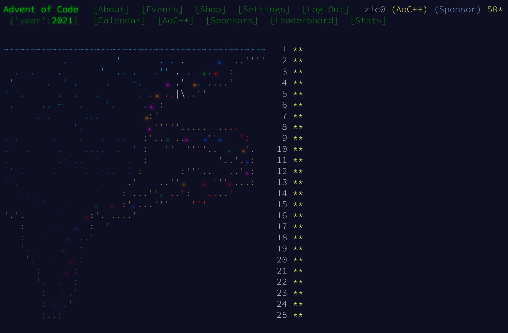
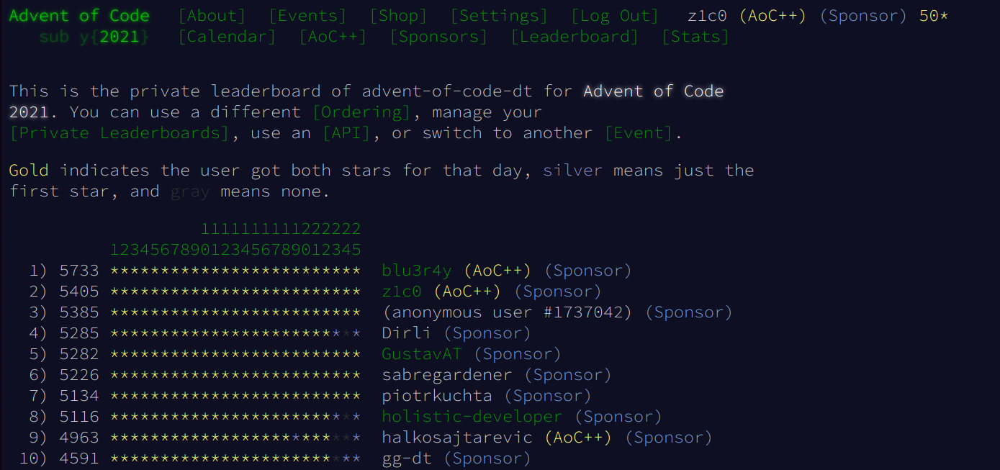
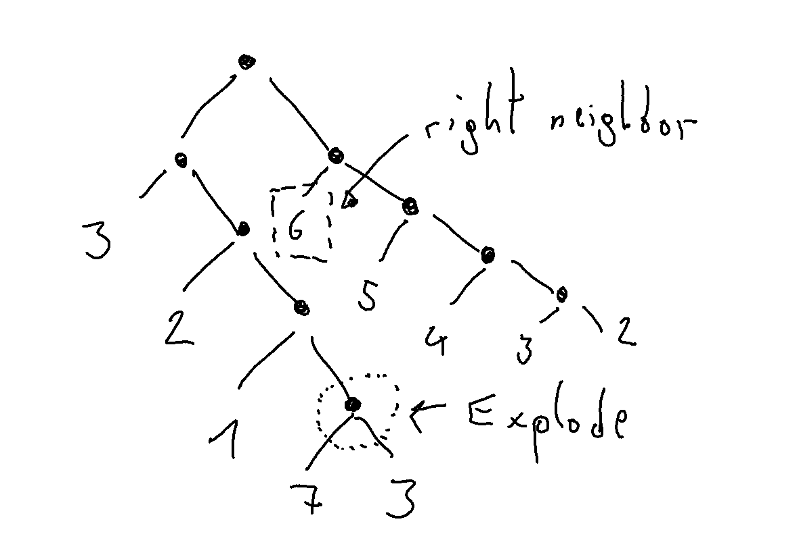
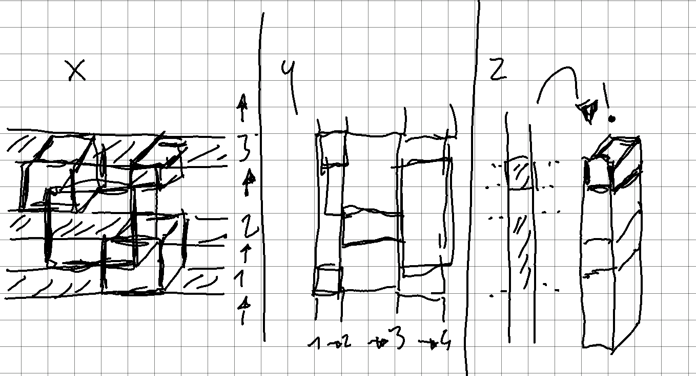

# Advent of Code 2021

<https://adventofcode.com/2021>





I ranked quite successfully on our [company's](http://dynatrace.com) leaderboard
(later finishers might still overtake me though).



## Day 18: Snailfish

This took me a bit longer than it should have, but I quite enjoyed this puzzle.
I made 3 errors that took me quite a while:

* I had a silly mistake in my **tree-traversal** code to figure out **right** or **left**
neighbors of a number, like in the example below where you have to walk the whole
tree up to find the right neighbor.

* I should have paid more attention to the **specification** here. In
my `Reduce` step, I made the mistake of applying the **first** reduction (`Explode` or `Split`)
I could find, however the specification clearly says to do *all* `Explode` first 🤦‍♂️.
* The **second part** was about finding the maximum of to snailfish number sums.
It turned out, the `+` operator I had implemented for my `SnailfishNumber` class
had a nasty **side-effect** that mutated its operands 😱. I was quite irritated
why this (apparently) easy second part would not yield the correct solution until
I figured this out.

## Day 19: Beacon Scanner

This was the first puzzle of that year that I could not solve on the day
it came out. I didn't even manage to solve the first part. I found a
solution that worked for the sample data, but it failed on the
actual input because of algorithmic complexity - basically, it did not finish.

It took me two more night sessions to figure this puzzle out and it was a tour de
force, but I finally succeeded (writing some of the ugliest and most convoluted code
in the last couple of years 😁).

It's always a huge please to reduce a problem that would not terminate in a life-time
in less than a second.

```text
Day 19 - START
Number of beacons: 454
Maximum distance between two scanners: 10813
END (after 0.5988131 seconds)
```

## Day 22: Reactor Reboot

Part 2 of this puzzle was the last star 🌟 I needed to complete this year's Advent of
Code and it brought me to the verge of despair ...

I'm notoriously bad at geometric algorithm problems especially when they involve more than
2 dimensions. So I immediately knew this puzzle would mean trouble when I saw the input
data.

It took me quite a few attempts to get this solved using a **plane/line-sweep** approach
but the end result turned out quite elegant and fast.

```Day 22 - START
577205 cubes are on.
1197308251666843 cubes are on.
END (after 0.8525968 seconds)
```

The trick was to partition the volumes by dimension. For that we collect the
start and end point of each cube (per dimension) and sort them. Then we "sweep"
through the volume using those dimensions. Think of it as breaking up each cube
into smaller pieces along each of the axes.



After the last dimension we have a "stack" of equally sized cubes that cover up each
other. This means we only have to look at the top of the stack since this was the last
"boot sequence" operation that shadows all other cubes below it. If it was an *"on"*
operation, we take it into account, otherwise not.

## Day 24: Arithmetic Logic Unit

I really enjoyed this puzzle, even though I did not great initially and it took me
quite a few hours to solve.

I made the mistake of trying to find a brute-force/dynamic programming solution first
which just did not terminate.

Only after many failed attempts I look at the *ALU* code closer and understood
what the code was actually doing and that it translated to two different kinds
of functions (with different parameters `a` and `b`) that operated on the digits.
This allowed me to create **inverse functions** (the name [`MONAD`](https://en.wikipedia.org/wiki/Monad_(functional_programming))
should have given it away in hindsight) which backtracked the solution then.